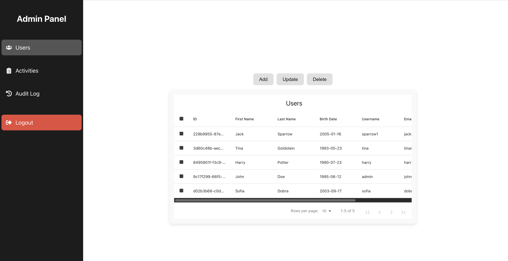
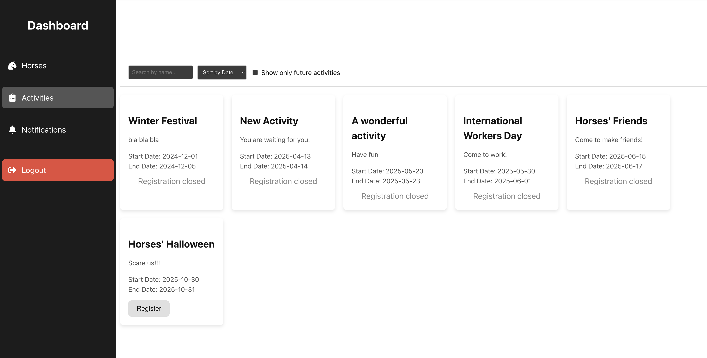
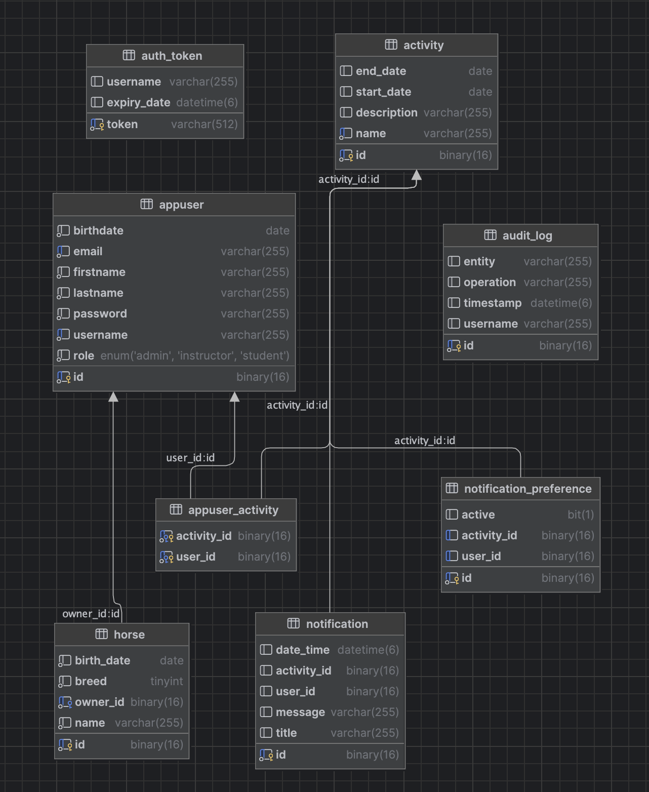

# Horseland Resort Web Application

Horseland Resort Web Application is a full-stack management system built with Spring Boot (backend) and React + TypeScript (frontend). It supports user, horse, and activity management with secure JWT-based authentication, role-based dashboards, password reset, and audit logging.

## Features
- Admin dashboard to manage users, horses, and activities
- Role-based access control using JWT
- Password reset flow with email verification
- Activity registration and participant management
- Secure storage of user credentials (hashed passwords)
- Audit logging of user actions

## Screenshots






## Setup
```bash
git clone https://github.com/yourusername/horseland-resort-web-application.git
cd horseland-resort-web-application
# Backend setup
cd backend
mvn clean install
# Frontend setup
cd ../frontend
npm install
npm start
